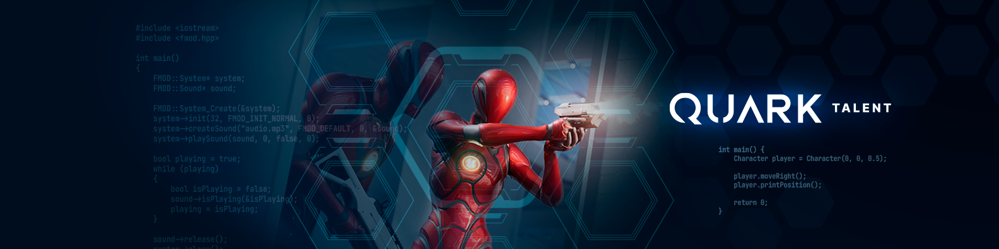
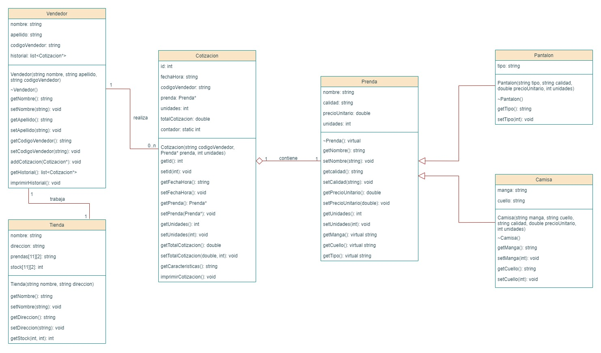

 </a>

<h3 align="center">Desafio Final Curso C++ - Cotizador de Prendas</h3>

---

 Resolucion del Desafio Final del Curso de C++ de Quark Academy. Consiste en un programa que sera utilizado por un vendedor de una tienda de ropa mayorista para realizar cotizaciones de sus productos.
      

---

## 📝 Tabla de Contenidos

- [Diagrama de Clases](#problem_statement)
- [Estructura](#idea)
- [Vista Previa](#usage)
- [Tecnologias](#tech_stack)
- [Autor](#authors)

## 🧐 Diagrama de Clases 

 

 </a>

 

## 💡 Estructura 

Estructura del proyecto:

    .
    ├── App                             # Main
    │   └── main.cpp                        # main
    ├── Domain                          # Dominio
    │   ├── Headers                         # Archivos de cabecera
    │   │   ├── Camisa.h                        # Cabecera de Clase Camisa
    │   │   ├── Cotizacion.h                    # Cabecera de Clase Cotizacion
    │   │   ├── Pantalon.h                      # Cabecera de Clase Pantalon
    │   │   ├── Prenda.h                        # Cabecera de Clase Prenda
    │   │   ├── Tienda.h                        # Cabecera de Clase Tienda
    │   │   └── Vendedor.h                      # Cabecera de Clase Vendedor
    │   ├── Camisa.cpp                      # Clase Camisa
    │   ├── Cotizacion.cpp                  # Clase Cotizacion
    │   ├── Pantalon.cpp                    # Clase Pantalon
    │   ├── Prenda.cpp                      # Clase Prenda
    │   ├── Tienda.cpp                      # Clase Tienda
    │   └── Vendedor.cpp                    # Clase Vendedor
    ├── Presenter                       # Presentador
    │   ├── Presenter.h                     # Cabecera de Clase Presentador
    │   └── Presenter.cpp                   # Clase Presentador
    └── View                            # Vista
        ├── View.h                          # Cabecera de Clase Vista
        └── View.cpp                        # Clase Vista

## 🎈 Vista Previa 

- Ventana Principal

 

- Pantalla de Seleccion
   

- Cotizacion realizada
   

- Historial de cotizaciones
   

## ⛏️ Tecnologias 

- C++ - Lenguaje
- Microsoft Visual Studio - IDE

## ✍️ Autor 

- Daniel Tejerina ([@mettralla](https://github.com/mettralla)) - [Linkedin](https://www.linkedin.com/in/daniel-alejandro-tejerina/)
